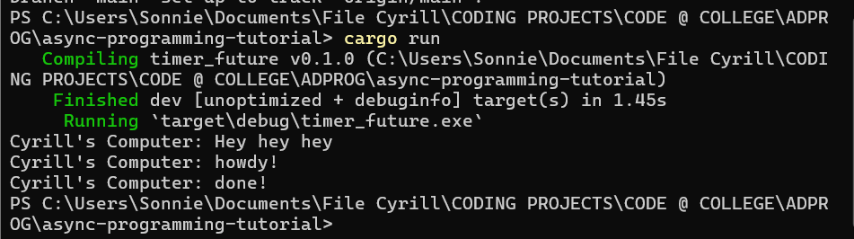
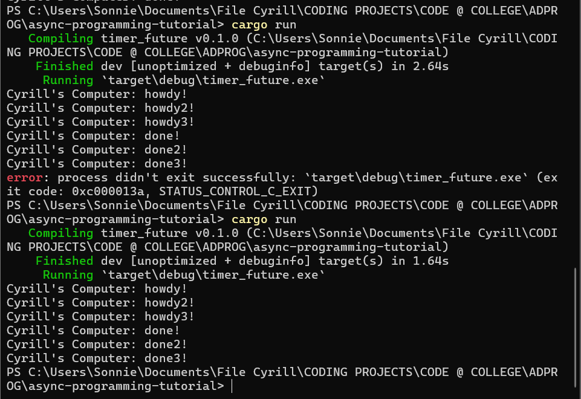

# Experiment 1.2: Understanding How It Works 

Even though the line `println('Cyrill's Computer: Hey hey hey')` is written after the line `spawner.spawn(...)`, The 'Cyrill's Computer: Hey hey hey' appears first in the terminal. This is because the `spawn` function schedules the task to be executed asynchronously, but it does not block the execution of the main thread. Therefore, the `println('Cyrill's Computer: Hey hey hey')` statement is executed immediately, while the spawned task runs concurrently in the background

# Experiment 1.3: Multiple Spawn and Removing Drop

`drop(spawner)` shows that we have finished sending message to the queue and the `executor` to finish the task in hand and finally end the program. By removing the `drop(spawner)` the executioner expects other tasks to be spawned. 

When spawning multiple tasks, the tasks are done asynchronously, therefore the result in the console are not in the same order. 